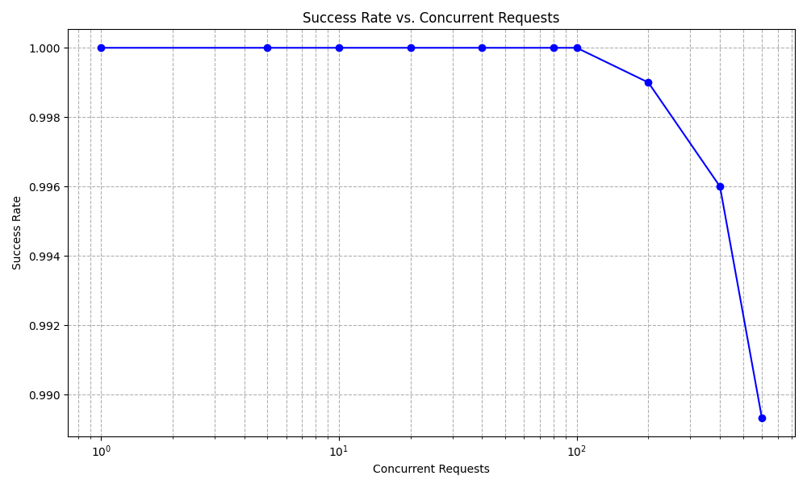
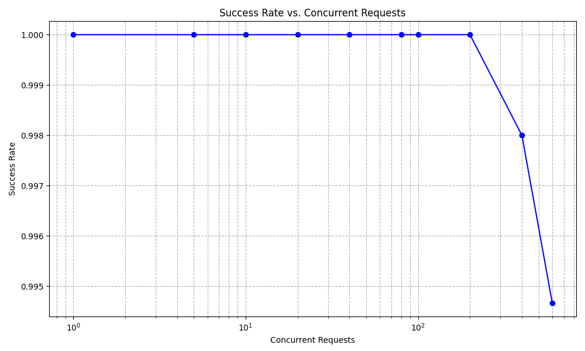

# Web Server & Web Caching

github link: https://github.com/JinchuLi2002/Webservers

## Web server
Defined in `app.py` is a simple implementation of a local webserver, hosting 5 pages (HTML can be found in `templates/`), each page has different number of pictures.
## Test of Web Server from a remote client.
Below is a screenshot of accessing the web server (hosted on laptop) from mobile phone.


## Performance Testing
In `test.py`, I have implemented a simple performance test for average latency and throughput. The test sends 1000 requests to the web server. And the results are as follows:
```
Total time for 100 requests: 0.1231832504272461 seconds
Average latency per request: 0.0012300395965576172 seconds
Throughput: 811.7986792292149 requests per second
```

## Stress 
In `saturate.py`, I have implemented a simple stress test for the web server. The test sends different number (100,200,300,400,500,600) parellel request in different processes to the web server. And the results are as follows:


As we can see, the success rate remained high, and I wasn't able to include more parallel processes due to hardware constraints. However, there is a slight drop in success rate as the number of parallel requests increases from 400 to 600, which could mean that the server is getting closer to saturation.

## Web Caching
In `app.py`, I have implemented a simple web caching mechanism using `flask_caching`. The cache is set to expire after 300 seconds. The cache is used to store the HTML content of the pages, and the cache is checked before serving the page. The results of the performance test after implementing caching are as follows:
```
Total time for 100 requests: 0.11452698707580566 seconds
Average latency per request: 0.001143662929534912 seconds
Throughput: 873.1566467719069 requests per second
```


As we can see, the throughput has increased and the average latency has decreased after implementing caching, as well as success rate in stress test.

## Discussion
1. Importance of Caching for Performance Improvement
Through this experience, I've learned that caching plays a crucial role in enhancing web server performance, albeit the improvements observed were relatively small in this context. By storing frequently requested data, caching reduces the need to repeatedly process the same requests, leading to slightly faster response times and a higher throughput.

2. The Limits of Hardware and Configuration
The stress testing highlighted the inherent limitations of hardware and the configuration of the web server. Despite attempting to saturate the server with a high number of parallel requests, the success rate only showed minor decline at higher levels of concurrency. This suggests that the server's capacity to handle requests is significantly influenced by the hardware capabilities and the optimization of server settings.

3. The Scalability Challenge
Engaging with the web server and implementing toy workloads revealed the challenges of scalability under varying loads. It became evident that while the server performed well under controlled test conditions, real-world applications would require more sophisticated strategies for scaling, load balancing, and resource management to maintain performance. This small-scale experiment underlines the complexity of maintaining high availability and responsiveness as demand increases.